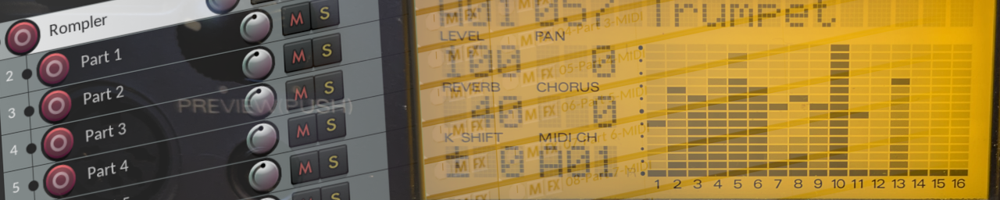

# SV Rompler Skeleton

SV Rompler Skeleton is a REAPER project file containing most of the
basic setup you need to make music on an external MIDI device such as a
rompler.

## Download
Click the colourful "Code" dropdown button at the top to download the
ZIP file. Extract, and get the `.RPP` file out. I'll probably put
together some release pages soon, but this will do for now.

## Usage
- Open the `.RPP` in [REAPER](https://www.reaper.fm/)
- Check that the `Rompler` track is routing MIDI to your external MIDI
  device
- Check that the `Rompler Output` track is monitoring audio output
  from your external MIDI device
- Update the SysEx message in the very first MIDI item to the reset
  message appropriate for your external MIDI device
- Start composing!

That's pretty much it, but there are some aspects of the project's
structure that are worth bearing in mind.

You'll notice an area of about 0.5 seconds before a first tempo
change. The very first MIDI item should exclusively contain the SysEx
reset message. All other setup CCs such as instrument selection via
program/bank changes should be inserted into the column of MIDI items
starting at 0.25s. This is to give the reset message time to take
effect.

Likewise, instrument selection messages should be placed at
the beginning of the MIDI items at 0.25s, and then your music should
start at 0.5s. This is to allow time for the instrument changes to
take effect.

There's nothing magic about these numbers by the way, I just picked
them because they should give most romplers ample time to load samples,
and they're not too uncomfortably long.

## Reset Messages
Every MIDI should start with a SysEx message to reset the MIDI device.
You should only include one depending on the standard you're using.
The name often varies in the documentation, but they usually use a
naming scheme similar to this table:

| MIDI Standard | SysEx Message |
| ------------- | ------------- |
| GM            | GM System On  |
| GM2           | GM2 System On |
| GS            | GS Reset      |
| XG            | XG Reset      |

As described under [Usage](#Usage), the very first MIDI item contains
a SysEx reset message. This is GS Reset for SC-88 Pro by default. If
you are using a different device and/or not using the default device
ID, you will have to change the message.

Here are a few valid reset messages for various romplers (assuming the
device ID hasn't been changed):
| Device    | Message Name  | Message                          | Source                                   | Notes |
| --------- | ------------- | -------------------------------- | ---------------------------------------- | ----- |
| SC-55     | GS Reset      | F0 41 10 42 12 40 00 7F 00 41 F7 | SC-55 Owner's Manual, pg. 53, 73, 77, 78 | The manual does not give a specific example of a GS reset message, but you can piece together from the listed pages that the usual GS Reset for Roland devices works. |
| SC-88 Pro | GM System On  | F0 7E 7F 09 01 F7                | SC-88 Pro Owner's Manual, pg. 191        |       |
| SC-88 Pro | GS Reset      | F0 41 10 42 12 40 00 7F 00 41 F7 | SC-88 Pro Owner's Manual, pg. 191        |       |
| SC-8820   | GM1 System On | F0 7E 7F 09 01 F7                | SC-8820 Owner's Manual, pg. 170          |       |
| SC-8820   | GM2 System On | F0 7E 7F 09 03 F7                | SC-8820 Owner's Manual, pg. 170          |       |
| SC-8820   | GS Reset      | F0 41 10 42 12 40 00 7F 00 41 F7 | SC-8820 Owner's Manual, pg. 170          |       |

If your rompler isn't in the list, you will have to consult your
rompler's documentation to find the SysEx messages it responds to. Of
course, you could always guess, since many devices try to use similar
messages. But this is no guarantee, as SysEx messages are not an
official MIDI standard. (It does stand for "System Exclusive" after
all)

## License
See license information in the [LICENSE](LICENSE) file.
